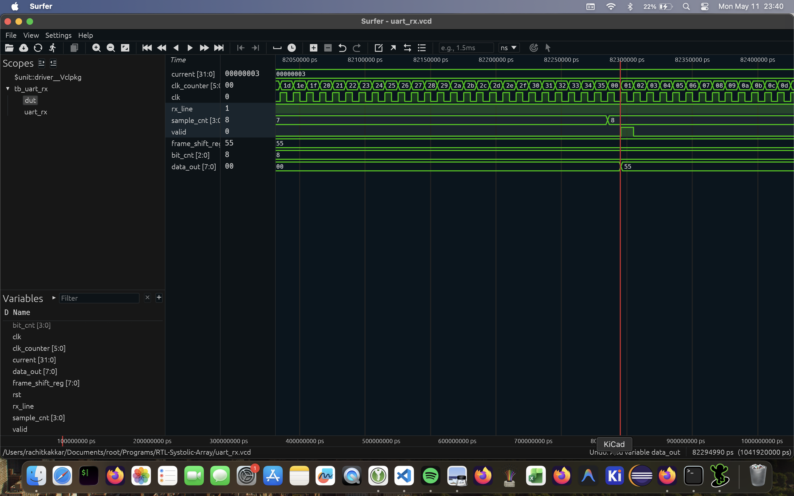

# RTL-Systolic-Array

A parameterizable hardware implementation of a 2D Systolic Array in SystemVerilog, designed primarily for matrix multiplication acceleration.

This project features a high-performance **AXI4-Stream** instrumentation bridge to stream input matrices and extract the computed results efficiently. This specific protocol was chosen because it is non-memory mapped, which is ideal for this application (where matrix data is transmitted in bursts).

## Overview

A systolic array computes matrix multiplication ($C = A \times B$) by pipelining the data flow through a mesh of identically structured Processing Elements (PEs). Essentially, this turns matrix multiplication from $O(n^3)$ to $O(n)$ by rolling-out two dimensions into hardware. In this particular *output-stationary* design, matrix $A$ rows stream horizontally, matrix $B$ columns stream vertically, and partial sums accumulate within each PE or are passed along.

### Key Components

- **`systolic_array.sv`**: The top-level array module. It handles data buffering and the necessary time-skewing logic so that matrix elements arrive at the correct Processing Element at the right clock cycle. Features parameterized array dimension (`N`) and precision (`DATA_WIDTH`).
- **`multiply_accumulate_unit.sv`**: The core Processing Element (PE). It performs a synchronous multiply-accumulate operation (`acc_out <= acc_in + in_top * in_side`) and pass-through forwarding of the `top` and `side` data to adjacent PEs.
- **`instrumentation.sv`**: The top-level state machine. It implements an AXI4-Stream interface (Master and Slave) wrapping the systolic array. This state machine manages the streaming of Matrix A and Matrix B into internal buffers, handles the ready/valid handshakes, drives the array for computation, and streams the resulting Matrix C out.
- **`uart_rx.sv`** (unused): A 16x oversampled UART receiver state machine with a default BAUD rate of 115.2 kps. This module was originally intended to serve as the communication bridge, allowing a host PC to stream matrices to the FPGA/accelerator. However, I later switched to an AXI4-Stream interface to improve perfromance.

These components can be found in the `rtl` directory.

### Architecture

**Top-Level Block Diagram**

To come

**Controller FSM**

To come

## Verification & Simulation

### File Structure and Build Instructions

The project uses **Verilator** for simulation and linting.
Testbenches are located in the `tb/` directory:
- `tb_systolic_array.sv`: Defines a SystemVerilog `interface` (`sys_if`) and a basic object-oriented testbench scaffold (e.g., generator, mailbox) to drive the matrix inputs.
- `tb_instrumentation.sv`: The generator produces test matrices, the driver controls the AXI handshakes, and the scoreboard verifies the output against mathematical expectations.
- `tb_uart_rx.sv`: Testbench for validating the UART receiver logic.

Other testbenches are expected to be added in the future.

The Verilator build configuration is specified in `verilator.f`, and past runs are avaliable in the `waveforms/` directory for debugging.

To run the instrumentation testbench:
```bash
verilator -f verilator.f
./obj_dir/Vtb_instrumentation
```

To generate random matricies and golden model result using Python, install `numpy` and run the `golden-model.py` script.

Everything has been tested on MacOS, but it should be cross-platform as it relies soley on Python, numpy, and Verilator.

### Waveforms

**tb_instrumentation.sv**


**tb_uart_rx.sv (unused)**



### Scoreboard Console Result

**tb_instrumentation.sv**

```
[SCOREBOARD] Loaded gold_result.hex
[GEN] Loaded matrix_a.hex and matrix_b.hex
[DRIVER] All data sent.
[SCOREBOARD][PASS] C[0][0] = -10794
[SCOREBOARD][PASS] C[0][1] = -3796
[SCOREBOARD][PASS] C[0][2] = 8814
[SCOREBOARD][PASS] C[0][3] = 1490
[SCOREBOARD][PASS] C[0][4] = -15529
[SCOREBOARD][PASS] C[0][5] = -5646
[SCOREBOARD][PASS] C[0][6] = 25923
[SCOREBOARD][PASS] C[0][7] = -4795
[SCOREBOARD][PASS] C[1][0] = -2849
[SCOREBOARD][PASS] C[1][1] = 11308
[SCOREBOARD][PASS] C[1][2] = 21987
[SCOREBOARD][PASS] C[1][3] = 6527
[SCOREBOARD][PASS] C[1][4] = -15419
[SCOREBOARD][PASS] C[1][5] = -6390
[SCOREBOARD][PASS] C[1][6] = -5042
[SCOREBOARD][PASS] C[1][7] = -7088
[SCOREBOARD][PASS] C[2][0] = -24263
[SCOREBOARD][PASS] C[2][1] = -32053
[SCOREBOARD][PASS] C[2][2] = -15802
[SCOREBOARD][PASS] C[2][3] = -750
[SCOREBOARD][PASS] C[2][4] = 17608
[SCOREBOARD][PASS] C[2][5] = 8288
[SCOREBOARD][PASS] C[2][6] = 4003
[SCOREBOARD][PASS] C[2][7] = -8981
[SCOREBOARD][PASS] C[3][0] = 17359
[SCOREBOARD][PASS] C[3][1] = 4059
[SCOREBOARD][PASS] C[3][2] = 11228
[SCOREBOARD][PASS] C[3][3] = -723
[SCOREBOARD][PASS] C[3][4] = 1070
[SCOREBOARD][PASS] C[3][5] = -2088
[SCOREBOARD][PASS] C[3][6] = -18498
[SCOREBOARD][PASS] C[3][7] = -11820
[SCOREBOARD][PASS] C[4][0] = -13697
[SCOREBOARD][PASS] C[4][1] = 16772
[SCOREBOARD][PASS] C[4][2] = 1985
[SCOREBOARD][PASS] C[4][3] = 13964
[SCOREBOARD][PASS] C[4][4] = -4136
[SCOREBOARD][PASS] C[4][5] = -10673
[SCOREBOARD][PASS] C[4][6] = 23884
[SCOREBOARD][PASS] C[4][7] = -19050
[SCOREBOARD][PASS] C[5][0] = 29617
[SCOREBOARD][PASS] C[5][1] = -12118
[SCOREBOARD][PASS] C[5][2] = -24467
[SCOREBOARD][PASS] C[5][3] = 3425
[SCOREBOARD][PASS] C[5][4] = -10787
[SCOREBOARD][PASS] C[5][5] = -7755
[SCOREBOARD][PASS] C[5][6] = 8766
[SCOREBOARD][PASS] C[5][7] = -10323
[SCOREBOARD][PASS] C[6][0] = -477
[SCOREBOARD][PASS] C[6][1] = -18579
[SCOREBOARD][PASS] C[6][2] = 23596
[SCOREBOARD][PASS] C[6][3] = -12950
[SCOREBOARD][PASS] C[6][4] = 17288
[SCOREBOARD][PASS] C[6][5] = 2303
[SCOREBOARD][PASS] C[6][6] = -21722
[SCOREBOARD][PASS] C[6][7] = -8264
[SCOREBOARD][PASS] C[7][0] = 2464
[SCOREBOARD][PASS] C[7][1] = -3802
[SCOREBOARD][PASS] C[7][2] = -6408
[SCOREBOARD][PASS] C[7][3] = -1962
[SCOREBOARD][PASS] C[7][4] = -11290
[SCOREBOARD][PASS] C[7][5] = 1714
[SCOREBOARD][PASS] C[7][6] = -8163
[SCOREBOARD][PASS] C[7][7] = 7693
[SCOREBOARD] --- Summary: 64 PASS, 0 FAIL ---
[TB] Simulation completed.
- tb/tb_instrumentation.sv:267: Verilog $finish
- S i m u l a t i o n   R e p o r t: Verilator 5.044 2026-01-01
- Verilator: $finish at 50us; walltime 0.002 s; speed 40.371 ms/s
- Verilator: cpu 0.001 s on 1 threads; alloced 2 MB
```

**tb_systolic_array.sv**

**tb_uart_rx.sv (unused)**

## Parameterization

The core array and AXI bridge can be configured at instantiation:
```systemverilog
instrumentation #(
  .N(8),               // Dimension of the NxN array
  .DATA_WIDTH(8)       // Bit-width for matrix inputs
) inst_module ( ... );
```

*Note: The accumulator width automatically scales to `2 * DATA_WIDTH` to prevent overflow during standard integer operations, and the AXI data widths are derived directly from the array dimensions.*